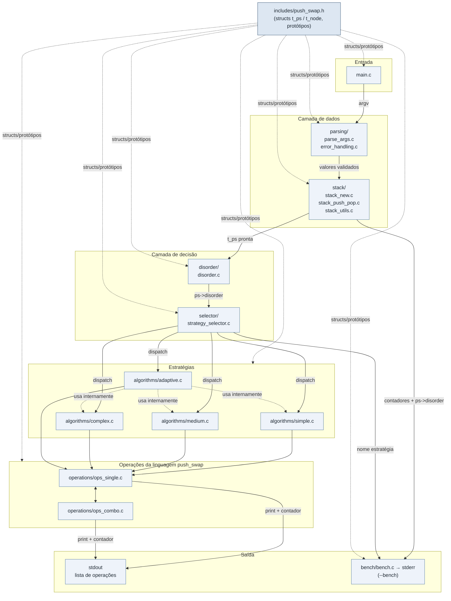

```mermaid
graph TD
    H["includes/push_swap.h<br/>(structs t_ps / t_node, protótipos)"]

    subgraph ENTRY["Entrada"]
        MAIN["main.c"]
    end

    subgraph CORE["Camada de dados"]
        PARSE["parsing/<br/>parse_args.c<br/>error_handling.c"]
        STACK["stack/<br/>stack_new.c<br/>stack_push_pop.c<br/>stack_utils.c"]
    end

    subgraph ENGINE["Camada de decisão"]
        DIS["disorder/<br/>disorder.c"]
        SEL["selector/<br/>strategy_selector.c"]
    end

    subgraph ALGOS["Estratégias"]
        SIMPLE["algorithms/simple.c"]
        MEDIUM["algorithms/medium.c"]
        COMPLEX["algorithms/complex.c"]
        ADAPT["algorithms/adaptive.c"]
    end

    subgraph OPS["Operações da linguagem push_swap"]
        OPSING["operations/ops_single.c"]
        OPCOMBO["operations/ops_combo.c"]
    end

    subgraph OUT["Saída"]
        STDOUT["stdout<br/>lista de operações"]
        BENCH["bench/bench.c → stderr<br/>(--bench)"]
    end

    MAIN -->|argv| PARSE
    PARSE -->|valores validados| STACK
    STACK -->|t_ps pronta| DIS
    DIS -->|ps->disorder| SEL
    SEL -->|dispatch| SIMPLE
    SEL -->|dispatch| MEDIUM
    SEL -->|dispatch| COMPLEX
    SEL -->|dispatch| ADAPT
    ADAPT -.usa internamente.-> SIMPLE
    ADAPT -.usa internamente.-> MEDIUM
    ADAPT -.usa internamente.-> COMPLEX

    SIMPLE --> OPSING
    MEDIUM --> OPSING
    COMPLEX --> OPSING
    ADAPT --> OPSING
    OPSING <--> OPCOMBO

    OPSING -->|print + contador| STDOUT
    OPCOMBO -->|print + contador| STDOUT
    STACK -->|contadores + ps->disorder| BENCH
    SEL -->|nome estratégia| BENCH

    H -.structs/protótipos.-> MAIN
    H -.structs/protótipos.-> PARSE
    H -.structs/protótipos.-> STACK
    H -.structs/protótipos.-> DIS
    H -.structs/protótipos.-> SEL
    H -.structs/protótipos.-> ALGOS
    H -.structs/protótipos.-> OPS
    H -.structs/protótipos.-> BENCH

    classDef default fill:#eef3fa,stroke:#5b7fa6,stroke-width:1px,color:#1f2933
    classDef header fill:#dde7f2,stroke:#3f5c7a,stroke-width:1px,color:#1f2933
    class H header
```
